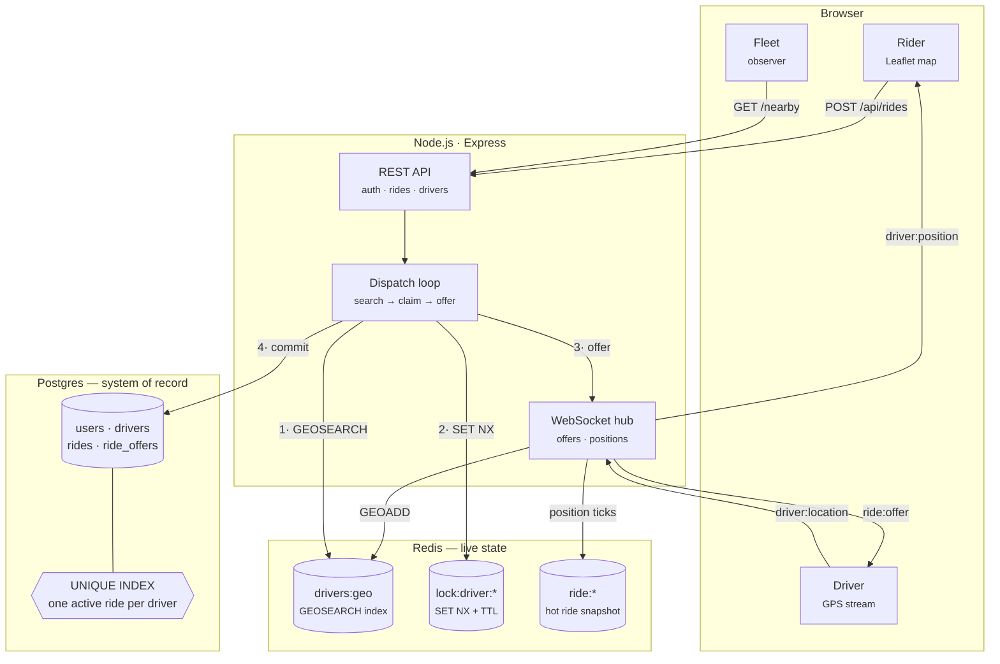

# Real-Time Ride Matching & Driver Tracking

A ride-hailing backend built around two problems that are genuinely hard and
genuinely interesting: **finding the nearest driver fast**, and **making sure
two riders can never be given the same one**.

Express + Postgres + Redis + WebSockets. No Kafka, no PostGIS, no routing
engine — see [How I'd scale this](#how-id-scale-this) for why, and what I'd add
first.

---

## Headline results

Both are reproducible from a clean checkout in about a minute (see [Quick
start](#quick-start)).

**Nearest-driver search is exact.** 25 drivers on a known grid, six probes at
different points and radii, every Redis result cross-checked against a
brute-force haversine scan computed independently in the test:

```
30 passed, 0 failed        worst distance error: 1.0 m over a 1.5 km radius
```

**Matching is race-condition safe.** Hundreds of ride requests fired
simultaneously at the same pickup point, against a deliberately scarce driver
pool, with every driver auto-accepting every offer — the worst case, since
nothing on the driver side breaks the tie for us:

| riders | drivers | matched | double-booked | all requests fired in |
|-------:|--------:|--------:|--------------:|----------------------:|
| 50     | 10      | **10**  | **0**         | 187 ms |
| 100    | 15      | **15**  | **0**         | 289 ms |
| 200    | 25      | **25**  | **0**         | 673 ms |
| 300    | 40      | **40**  | **0**         | 853 ms |
| 500    | 60      | **60**  | **0**         | 878 ms |

Every driver gets exactly one ride, every surplus rider is told "no drivers
available", and nobody is left hanging.

Plus 22 unit tests, including *"exactly one of 200 concurrent claims on a single
driver wins"*.

---

## The interesting part: how double-booking is prevented

### The race

Two riders request a ride at the same instant, in the same place:

```
rider A                            rider B
   │                                  │
   ├─ GEOSEARCH → driver 7            ├─ GEOSEARCH → driver 7     ← same answer
   ├─ send offer to driver 7          ├─ send offer to driver 7
   │                                  │
   │        driver 7 taps "accept" ───┤
   │                                  │
   └─ writes ride A ← driver 7        └─ writes ride B ← driver 7  ← double-booked
```

The window is not microseconds. It is the several *seconds* a human spends
looking at an offer before tapping a button. Anything that only synchronises the
final write is too late.

### The fix

Claiming a driver is a **single atomic Redis operation, taken before the offer
is ever shown**:

```js
SET lock:driver:<id> <rideId> NX PX 8000
```

`NX` means set-only-if-absent. Redis executes commands one at a time, so of *N*
concurrent claims on one driver, **exactly one returns OK**. The losers get
`null` immediately and move on to their next candidate — no queueing, no
blocking, no retry storm.

```
rider A                            rider B
   │                                  │
   ├─ SET NX driver:7  → OK           ├─ SET NX driver:7  → nil   ← loses, instantly
   ├─ ZREM from search index          ├─ next candidate: driver 9
   ├─ send offer to driver 7          ├─ SET NX driver:9  → OK
   │                                  ├─ send offer to driver 9
   └─ accepted → ride A               └─ accepted → ride B
```

Four properties make this hold up:

**1. The lock is taken before the offer, not after the accept.** This is the
whole point. Locking on accept would leave the human-decision window unguarded,
which is exactly where the race lives.

**2. A claimed driver leaves the search index.** `ZREM` on the geo set means
concurrent searches don't even see them as a candidate — contention is avoided
rather than merely resolved.

**3. Every lock has a TTL.** If the process dies between locking and offering,
the driver frees themselves after `OFFER_TIMEOUT_MS` instead of being stranded
forever. On accept, the lock is `PERSIST`ed so it survives for the length of the
ride, and the ride's terminal transition releases it.

**4. Unlocking is guarded by ownership.** Release is a compare-and-delete in
Lua, not a bare `DEL`:

```lua
if redis.call('GET', KEYS[1]) == ARGV[1] then
  return redis.call('DEL', KEYS[1])
end
return 0
```

Without this there's a subtle bug: ride A's lock expires, ride B legitimately
claims the driver, and A's late unlock frees B's driver out from under it.
[`test/lock.test.js`](test/lock.test.js) tests exactly that sequence.

### The second line of defence

Redis is the fast path. Postgres is the durable backstop:

```sql
CREATE UNIQUE INDEX rides_one_active_per_driver
  ON rides (driver_id)
  WHERE driver_id IS NOT NULL AND status IN ('matched', 'in_progress');
```

Even if Redis were flushed, restarted, or a lock expired mid-flight, the
database *physically cannot* record two live rides for one driver. The write
fails, and the dispatcher treats that as a lost race and moves on.

### Proof the tests aren't vacuous

A safety test that has never failed proves nothing. Setting `UNSAFE_DISABLE_LOCK=1`
makes `tryLockDriver` behave like an implementation with no locking at all, and
the same test run against it fails:

```
  PASS  no driver assigned to more than one live ride     ← Postgres backstop held
  FAIL  redis locks agree with postgres ride assignments
  FAIL  all 10 available drivers were matched             ← matched 6 of 10
```

and the server log shows the backstop actually catching a double-booking:

```
[dispatch] backstop fired: driver 86c3932b… already has a live ride
           (ride e613fe84… rejected by rides_one_active_per_driver)
```

The layers do different jobs, and you can see each one working. With locking
off, correctness survives but throughput collapses — 4 of 10 drivers wasted.

---

## A bug the load test found

At 300 riders vs 40 drivers, safety held perfectly but **only 24 of 40 drivers
got matched**. Sixteen drivers sat free while riders were told nobody was
available.

The cause was a conflation in the dispatch loop. `MAX_CANDIDATES` was capping
*drivers examined*, but two very different things were being counted against it:

- an **offer** that got refused or timed out — costs up to `OFFER_TIMEOUT_MS`
- a **lost lock race** — costs one Redis round-trip, about a millisecond

Under heavy contention a rider would burn all five attempts losing lock races to
faster riders, then give up — while free drivers sat one position further down
the list.

The fix is two separate budgets. `MAX_CANDIDATES` (5) caps offers actually made,
which is what bounds the rider's worst-case wait. `MAX_SCAN_CANDIDATES` (60)
caps drivers examined, since skipping an already-claimed one is nearly free.

```
before:  24 / 40 drivers matched
after:   40 / 40 drivers matched
```

This is why the "no wasted capacity" assertion exists at all: every safety
assertion in the suite is trivially satisfied by a system that refuses to match
anyone, so a liveness check has to sit alongside them. It is the assertion that
caught this.

---

## Architecture



### Why the split

Postgres and Redis hold different things on purpose.

**Postgres is the system of record** — accounts, ride history, state
transitions, and the uniqueness constraint that makes double-booking
structurally impossible. Anything that must survive a restart and be auditable
afterwards.

**Redis holds live state** — driver positions, availability, locks. This data is
written several times a second per driver, read on every match, and worthless
sixty seconds later. Three properties make it the right home:

- **`GEOSEARCH` is a real nearest-neighbour query.** Positions are stored as
  geohash-encoded scores in a sorted set, so "nearest 10 drivers within 5 km,
  closest first" is a range scan, not a table scan over every driver.
- **`SET NX` gives atomic claiming for free**, single-node-safe today and
  multi-node-safe unchanged.
- **Availability is set membership.** A driver is in `drivers:geo` if and only
  if they're available, so the hot query never filters out busy drivers — they
  aren't there.

A position tick costs **two Redis reads and zero database queries**: the
driver→ride pointer and the cached ride snapshot. That's the difference between
this scaling and not — at 500 drivers pinging every second, routing through
Postgres would mean 500 queries/sec of pure overhead.

### Surviving a restart

Redis runs without persistence here, which is the right call for data that's
rewritten every second — but it means a restart wipes every lock while Postgres
keeps every in-flight ride. Left alone, a driver already carrying a rider would
look unlocked and could be offered a second ride. The database backstop would
refuse the write, but only after the rider had been promised a car.

So the durable record wins at boot: `reconcileLiveRides()` reads every
`matched` / `in_progress` ride from Postgres and rebuilds its lock, its
active-ride pointer and its cached snapshot before the first request is served.

```
[boot] cleared stale driver availability index
[boot] reconciled 1 in-flight ride(s) from postgres
```

### Ride lifecycle

```
requested ──► matched ──► in_progress ──► completed
    │            │
    │            └──► cancelled
    └──► no_drivers          (rider cancels before pickup)
       (no driver accepted)
```

Every transition is a guarded `UPDATE ... WHERE status = <expected>`, so two
concurrent attempts can't both succeed — the second matches zero rows and 409s.

### Request flow

1. `POST /api/rides` writes the ride and returns **201 immediately** — dispatch
   is deliberately not awaited, since it can run for tens of seconds while
   drivers are offered the ride one at a time. The rider learns the outcome over
   the WebSocket.
2. The dispatch loop searches, claims, offers, and waits.
3. On accept, the match is committed in a transaction conditional on the ride
   still being `requested`, so a cancellation landing mid-dispatch wins cleanly.
4. Position ticks flow driver → server → rider for the rest of the trip.

---

## Quick start

Requires Docker and Node 18+.

```bash
npm install
npm run infra:up      # Postgres :5433, Redis :6380 — schema loads automatically
npm start             # http://localhost:3100
npm run seed          # demo accounts, password: "password"
```

Then, in a second terminal:

```bash
npm run sim:drivers -- --count=25 --auto-accept
```

Open **http://localhost:3100**, click the map twice to set pickup and dropoff,
and request a ride. A simulated driver accepts, drives to you, and you watch the
car move in real time.

| page | what it's for |
|---|---|
| `/` | Rider — request a ride, watch the driver approach |
| `/driver.html` | Driver — go online, accept offers, run the trip |
| `/fleet.html` | Observer — live fleet, and a click-anywhere `GEOSEARCH` probe |

`/fleet.html` is the one worth opening first: every dot is a row in the Redis
sorted set, and clicking the map runs the exact query the dispatcher runs,
drawing a line to each hit with its distance and result time.

### Verifying the claims

```bash
npm test              # 22 unit tests (geo maths + locking primitives)
npm run test:geo      # nearest-driver search vs. brute-force haversine
npm run test:race     # the concurrent matching test
npm run test:race -- --riders=300 --drivers=40
```

Stop the fleet simulator before running `test:race` — its drivers would join the
pool and skew the driver count.

To watch the safety net fail on purpose:

```bash
UNSAFE_DISABLE_LOCK=1 npm start     # then re-run npm run test:race
```

---

## Project layout

```
src/
  services/
    lock.service.js      ← the driver-locking mechanism
    matching.service.js  ← the dispatch loop
    geo.service.js       ← Redis GEOSEARCH wrapper
    ride.service.js      ← lifecycle + state transitions
  ws/
    hub.js               ← socket registry, offer response bus
    handlers.js          ← position ingest, offer accept/reject
  routes/                ← auth, drivers, rides
  lib/geo.js             ← haversine, ETA, bearings (pure, unit-tested)
db/schema.sql            ← tables + the anti-double-booking index
sim/
  simulate-drivers.js    ← N drivers on a street grid
  verify-nearby.js       ← geospatial correctness proof
  load-test-match.js     ← the concurrency proof
public/                  ← rider, driver, and fleet UIs (Leaflet)
test/                    ← unit tests
```

## API

| method | path | notes |
|---|---|---|
| `POST` | `/api/auth/register` · `/login` | JWT, 7-day expiry |
| `POST` | `/api/drivers/online` · `/offline` | availability toggle |
| `GET`  | `/api/drivers/nearby?lat=&lng=&radius=&limit=` | the geospatial query, public |
| `POST` | `/api/rides` | returns 201 immediately; match arrives over WS |
| `POST` | `/api/rides/:id/start` · `/complete` · `/cancel` | guarded transitions |
| `GET`  | `/api/rides/active` · `/history` · `/:id` | |
| `GET`  | `/health` | store health, socket counts, pool size |

**WebSocket** `ws://host/ws?token=<jwt>`

| ↑ client → server | ↓ server → client |
|---|---|
| `driver:location` | `ride:offer` · `ride:offer_expired` |
| `driver:accept` / `driver:reject` | `ride:matched` · `ride:assigned` · `ride:status` |
| `ping` | `driver:position` · `ride:no_drivers` |

---

## How I'd scale this

Honest accounting of what this build does not do, and what I'd reach for.

**Multi-node dispatch.** The locking is already multi-node safe — it lives in
Redis, which is the part that matters for correctness. What isn't is offer
*routing*: the WebSocket hub is in-process, so a driver connected to node B
can't receive an offer dispatched on node A. The fix is a Redis pub/sub fan-out
keyed by driver id. Only `hub.sendToDriver` and `hub.waitForOffer` change;
nothing above them does.

**Real routing and ETAs.** ETAs are straight-line distance over an assumed
average speed. A driver two minutes away across a river reads as thirty seconds.
OSRM or Valhalla would replace `etaSeconds()` — points in, seconds out, so it's
a one-function swap. Matching on road-network time rather than crow-flies
distance would also pick genuinely better drivers.

**PostGIS.** Redis handles live positions well, but it only stores points. Ride
*history* — heatmaps, "where do trips start on Friday nights", zone-based
pricing — wants real geometry, spatial joins, and polygon containment. That's
Postgres + PostGIS territory, on the historical data, not the hot path.

**Kafka.** Right now the ride lifecycle writes to Postgres and pushes over
WebSocket, and that's it. The moment anything else needs to react to a completed
ride — billing, driver payouts, fraud scoring, an analytics warehouse — bolting
each one into the request path is how services rot. Emitting lifecycle events to
a log and letting consumers subscribe keeps dispatch fast and decoupled.

**Surge pricing.** Needs a demand/supply ratio per geohash cell over a sliding
window — which the Redis geo index already gives cheaply. I left it out because
it's a pricing feature, not a distributed-systems one, and the interesting part
of this project is the matching.

**Driver assignment quality.** Currently strictly nearest-first. Real dispatch
optimises globally — batching requests over a short window and solving an
assignment problem beats greedy per-rider matching, especially at surge. Greedy
is the right call at this scale and the wrong one at city scale.

**A reaper for abandoned rides.** If a driver disappears mid-trip — phone dies,
app killed — the ride sits in `in_progress` forever. The rider can cancel before
pickup but not after, so the trip needs an operator or a timeout to clear it. A
sweep over rides whose driver hasn't reported a position in *N* minutes, moving
them to a `stalled` state and releasing the driver, is the missing piece. I hit
this for real while testing: a simulated driver was killed mid-ride and its ride
stayed live across a restart.

**Operational gaps.** No rate limiting, no refresh tokens, no structured
logging, no metrics export. Fine for a demo, not for production.
